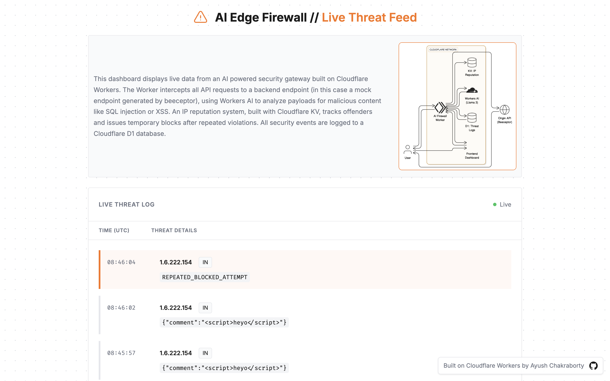
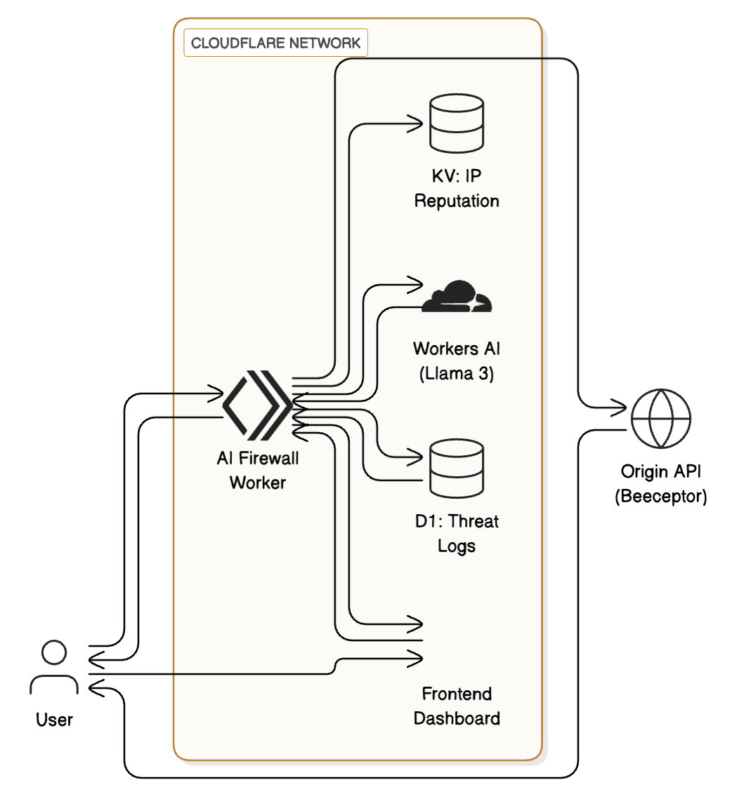

# AI Edge Firewall

A serverless, AI-powered security gateway built on the Cloudflare stack. This project intercepts API requests at the edge, using a Large Language Model to perform real-time payload analysis and block threats before they reach the origin server.

The demo is the dashboard for the interceptor

Live Demo: [ai-edge-firewall-dashboard.pages.dev](ai-edge-firewall-dashboard.pages.dev)


## Core Concept

Traditional firewalls are effective at blocking traffic based on simple rules like IP address or request rate, but they are blind to the content of a request. Modern applications, especially those using downstream AI services, are vulnerable to sophisticated payload attacks like SQL injection, cross-site scripting (XSS), and prompt injection.

This project solves that problem by deploying an intelligent security layer to Cloudflare's global edge network. It acts as a reverse proxy that inspects the body of incoming POST, PUT, and DELETE requests, providing a level of security that traditional firewalls cannot.

## Features

* AI-Powered Threat Detection: Utilizes Workers AI (running Llama 3) to analyze JSON payloads for malicious content in real-time.

* IP Reputation System: A stateful firewall built with Cloudflare KV. It tracks malicious requests from individual IP addresses and issues temporary blocks after a set number of violations.

* Globally Distributed at the Edge: Built on Cloudflare Workers, the entire security logic runs in the data center closest to the user, ensuring millisecond latency and instant scalability.

* Persistent Threat Logging: All security events are logged to a Cloudflare D1 (SQLite) database for permanent storage and analysis.

* Real-Time Threat Dashboard: A lightweight frontend built with vanilla HTML/JS and hosted on Cloudflare Pages provides a live, auto-updating feed of detected threats.

## System Design

The architecture is fully serverless, leveraging multiple services within the Cloudflare ecosystem. The Worker acts as the central hub, coordinating between the AI, KV (for caching/reputation), and D1 (for logging).



## Tech Stack

* Compute: Cloudflare Workers

* AI Inference: Workers AI

* Database: Cloudflare D1

* Key-Value Store: Cloudflare KV

* Frontend Hosting: Cloudflare Pages

* CLI/Deployment: Wrangler

* Frontend: Vanilla HTML, CSS, JavaScript (No frameworks)

## Testing the Live Deployment

To test the live firewall and see threats appear on your dashboard, you must send requests to the Worker URL, which acts as the gateway to the actual endpoint defined by you.

For local development, define your own backend endpoint in .dev.vars first. The rest is taken care of in the worker code and replace https://ai-edge-firewall.your-username.workers.dev in the examples below with your actual deployed Worker URL.

**Note**: To test the live demo instance for this repository, use the following URL for the below curl commands, this is enough for the dashboard to show the updates in real time, the other parts are for running it locally, which is not really needed:
https://ai-edge-firewall.chakrabortyayush83.workers.dev


## Send a Safe Request
This request has a harmless payload. The AI will approve it, and it will be silently forwarded to the backend. Nothing will appear on the dashboard.

```shell
curl -X POST \
  -H "Content-Type: application/json" \
  -d '{"username": "testuser", "comment": "This is a great product!"}' \
  https://ai-edge-firewall.your-username.workers.dev
```

## Send a Malicious Request
This request contains a classic Cross-Site Scripting (XSS) attack. The AI will flag it as malicious. The Worker will block the request and log it to the D1 database. Within 5 seconds, it will appear at the top of your live threat dashboard.

```shell
curl -X POST \
  -H "Content-Type: application/json" \
  -d '{"comment": "Nice website! <script>alert(\"XSS\")</script>"}' \
    https://ai-edge-firewall.your-username.workers.dev
```

Send the malicious request multiple times to test the IP reputation system and see the REPEATED_BLOCKED_ATTEMPT logs appear.

For local development, you will need two terminal windows to run the backend and frontend simultaneously.

## Prerequisites

* Node.js (v18+) and npm

* A free Cloudflare account

* Clone & Install Dependencies
git clone [https://github.com/AyushChakraborty/ai_edge_firewall](https://github.com/AyushChakraborty/ai_edge_firewall)


## Install backend dependencies

1. npm install

2. Set Up Local Database
Create the threats table in your local D1 simulation by applying the migration
    ```shell
    npx wrangler d1 migrations apply threat-dashboard-db --local
    ```

3. Run the Backend (Terminal 1)
Start the local development server for the Worker. This will serve the API on localhost
    ```shell
    npx wrangler dev
    ```

4. Run the Frontend (Terminal 2)
The frontend is a single HTML file.
Open frontend/index.html in your code editor.

Find the ANALYTICS_ENDPOINT constant in the script tag

Change the URL to your local worker address (assuming it runs in localhost:8787):
    ```typescript
    const ANALYTICS_ENDPOINT = 'http://localhost:8787/analytics';
    ```

Open the frontend/index.html file directly in your web browser. The dashboard will now fetch data from your local Worker.

## Deployment

This project requires a two part deployment: one for the Worker (backend) and one for the Pages site (frontend).

1. Deploy the Worker Backend
First, ensure your production D1 database has the correct schema.

2. Apply migrations to the remote D1 database
npx wrangler d1 migrations apply threat-dashboard-db --remote

Then, deploy the Worker.

3. Deploy the worker to your Cloudflare account
npx wrangler deploy

    This will output your production Worker URL. Copy this URL.

4. Deploy the Frontend
	The frontend is deployed to Cloudflare Pages and connected to the live Worker via a proxy rule.

	Commit and push all your changes to your GitHub repository.
	
	Connect to Cloudflare Pages:
	
	In the Cloudflare dashboard, go to Workers & Pages -> Create application -> Pages -> Connect to Git.
	
	Select your repository.
	
	On the "Set up builds and deployments" screen, use the following configuration:
	
	Framework preset: None
	
	Build command: (leave blank)
	
	Build output directory: frontend
	
	Click Save and Deploy.
